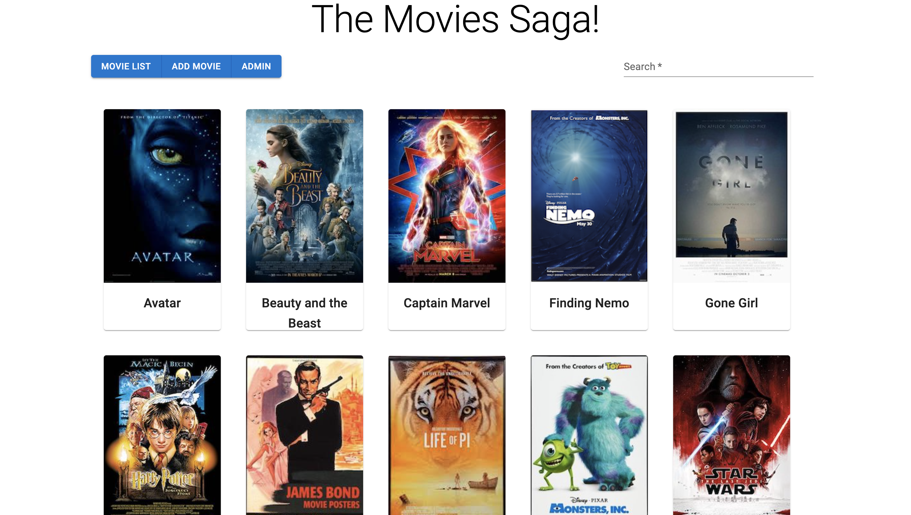
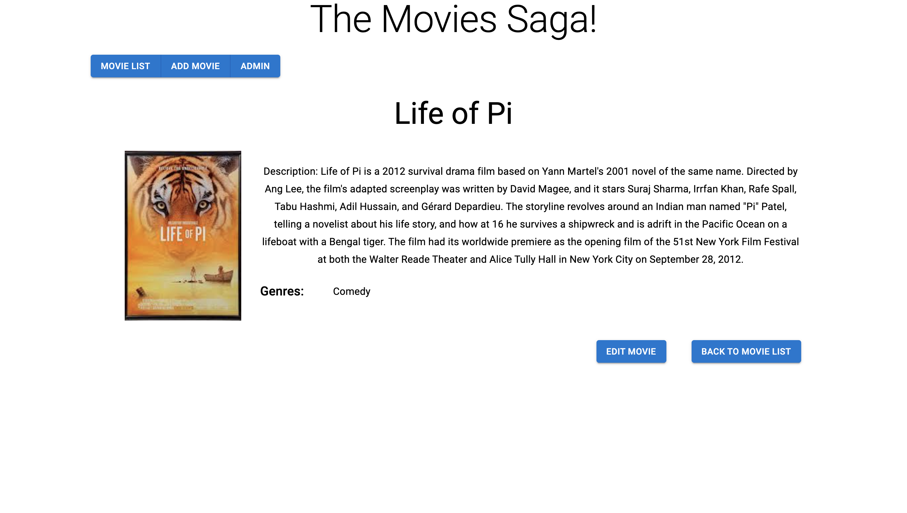
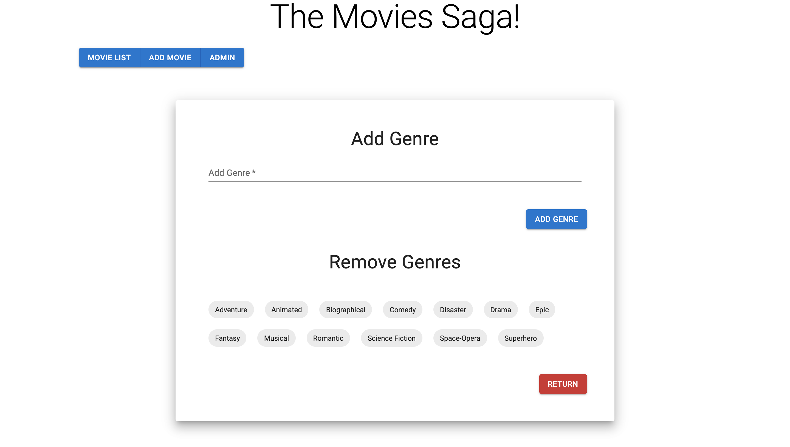

# Movies Saga

## Description

_Duration: Weekend Challenge_

This app is a movie list app. Users can view the top ten movies in the main page, but also search for specific movies (with no limit) by typing in the search box in the top right of the app. The search is immediate; results appear as the user types.

The user can also add movies (by supplying a title, poster url, description, and genres). Users can later edit movies by clicking on the movie on the main page—which will display the selected movie's details—and then selecting edit on the next page.

An additional feature is that (after a mock login - )

The app uses a [PostgreSQL](https://www.postgresql.org/) database to store the movies and genres, [Express](https://expressjs.com/) / [Node.js](https://nodejs.org/en/) as a server, and [React](https://reactjs.org/), [Redux](https://redux.js.org/), and [Redux-Saga](https://redux-saga.js.org/) on the front end. Styling is provided by [Material-UI](https://mui.com/).

## Screenshots


_Main movie screen._


_Selected movie details screen._


_Edit movie screen._


_Main movie screen._

## Prerequisites

- [Node.js](https://nodejs.org/en/)
- [PostgreSQL](https://www.postgresql.org/)

## Installation

1. After cloning this repository, set up a PostgreSQL database called `saga_movies_weekend` on port 5432. You might want to use [Postico](https://eggerapps.at/postico/) as a GUI to help this setup process.
2. Use the commands in the `database.sql` file in the root directory of the project to set up a table in the database with some dummy data.
3. Run `npm install` to install dependencies in this project.
4. In the root directory of the project, set up a file called `.env` and in this file add only the following lines, where the text in quotation marks should appear without quotation marks, but be the desired admin username and password:

```
USERNAME="username"
PASSWORD="password"
```

5. Run `npm server start` to start the server, which will run on port 5000.
6. Run `npm client start` to start the client, which will run on port 3000.
7. Running the client should open up a browser window to `localhost:3000` where you can view and use the app. You can also manually type in this address in your browser.

## Usage

1. Navigating to `localhost:3000/` will start the app. A list of ten movies, listed alphabetically, will appear.
2. Clicking on the poster of any movie will open up a page with more detail on that specific movie (including the full description and the movie's genre).
3. Users can click on the edit button to edit any aspect of the selected movie's details. Users will be brought to a new page with several boxes (similar to the add movie page, discussed next), and the option to update the movie.
4. Clicking on "Add Movie" at any point in the app will open up a screen with boxes similar to the edit screen, where users can add new movies by filling out the title, poster url, and description fields, and selecting one or more genres.
5. On the main page, where the list of movies appears, users can search for movies by typing text into the search bar. The movie list will adjust as soon as the user starts typing. Searching returns any title of any movie that includes the string entered in the search box.
6. There is also an admin page to add or remove genres. Users can click on the admin link and will only advance to the add or remove genres page when the login details are filled out correctly.
7. Typing a genre into the genre box and selecting "Add Genre" will add the genre to the database, which will allow users to assign that genre to any new movies / update existing movies to have this genre.
8. Deleting a genre will delete the genre that is clicked on. It will also remove any references to that genre attached to any movies (so be careful!).

## Built With

1. [Node.js](https://nodejs.org/en/)
2. [Express](https://expressjs.com/)
3. [React](https://reactjs.org/)
4. [Redux](https://redux.js.org/)
5. [Redux-Saga](https://redux-saga.js.org/)
6. [PostgreSQL](https://www.postgresql.org/)
7. [Material-UI](https://mui.com/)
8. [axios](https://www.npmjs.com/package/axios)
9. HTML
10. CSS

## Acknowledgement

Thanks to [Prime Digital Academy](www.primeacademy.io) who equipped and helped me to make this application a reality.
